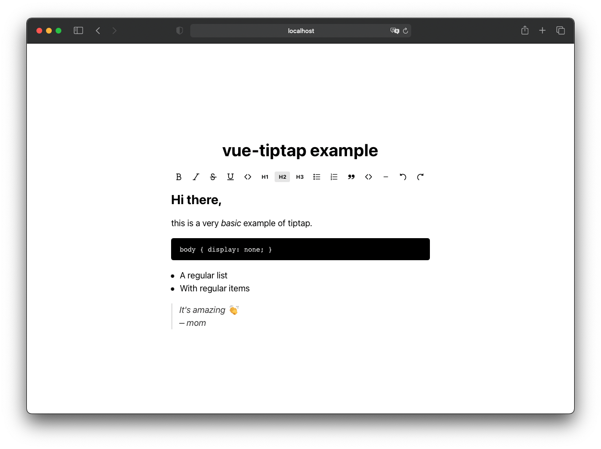

# vue-tiptap


Example of using tiptap as a Vue component without being completely renderless, so you can see how to use it inside your own components or even use it right away.



## Install and Usage

```bash

# install dependencies
yarn

# build component
yarn build

# serve demo
yarn serve
```

## License

The MIT License (MIT). Please see [License File](LICENSE.md) for more information.

SVG Icons from the original [TipTap](https://github.com/scrumpy/tiptap/) package.
