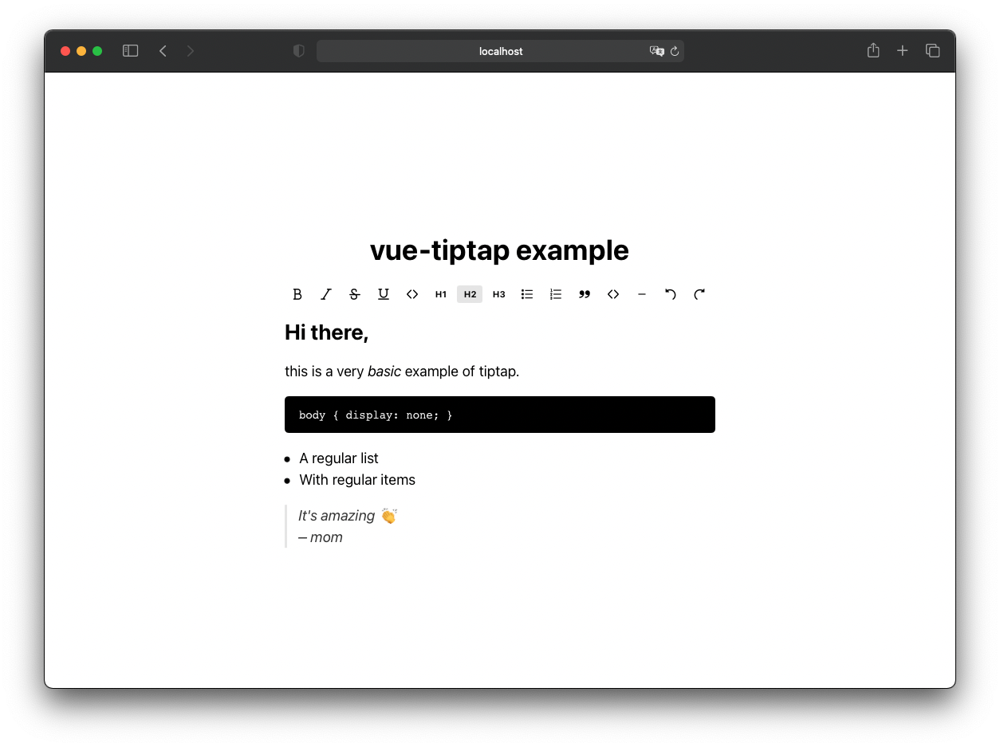

# vue-tiptap

[](https://www.npmjs.com/package/vue-tiptap)
[](https://www.npmjs.com/package/vue-tiptap)
[](https://github.com/neverbot/vue-tiptap/blob/master/LICENSE.md)
[](https://www.npmjs.com/package/vue-tiptap)

Example of using [tiptap](https://github.com/ueberdosis/tiptap) as a Vue 3 component without being completely renderless, so you can see how to use it inside your own components or even use it right away. It can be imported as a Vue 3 component, and you can see in the `example` directory how it would be used inside your application.

**Note**: now tiptap has their own examples and components for different frameworks (including vue 2 and vue 3), so maybe you should take a look to the official package [@tiptap/vue-3](https://tiptap.dev/docs/editor/getting-started/install/vue3). This package will probably not be updated anymore.



## Install

```bash
npm install vue-tiptap
```

The styles are not bundled into the component, so you also need
[`sass`](https://www.npmjs.com/package/sass) in your project to compile
them:

```bash
npm install --save-dev sass
```

## Usage

```vue
<template>
  <editor
    :initial-content="content"
    :active-buttons="['bold', 'italic', 'h1', 'bulletList', 'undo', 'redo']"
    @update="onUpdate"
  />
</template>

<script>
import Editor from 'vue-tiptap';
import 'vue-tiptap/style';

export default {
  components: { Editor },
  data() {
    return { content: '<p>Hello <em>world</em></p>' };
  },
  methods: {
    onUpdate(html) {
      this.content = html;
    },
  },
};
</script>
```

### Props

| Prop             | Type     | Default                    | Description                             |
| ---------------- | -------- | -------------------------- | --------------------------------------- |
| `initialContent` | `String` | `'<em>editable text</em>'` | HTML the editor starts with.            |
| `activeButtons`  | `Array`  | `['bold', 'italic']`       | Which toolbar buttons to render, in order. |

Accepted `activeButtons` values:

`bold`, `italic`, `strike`, `underline`, `code`, `h1`, `h2`, `h3`,
`bulletList`, `orderedList`, `blockquote`, `codeBlock`,
`horizontalRule`, `undo`, `redo`

### Events

| Event    | Payload  | Description                                        |
| -------- | -------- | -------------------------------------------------- |
| `update` | `String` | The full HTML of the document, on every change.    |

### Styles

`vue-tiptap/style` is the whole stylesheet: a small reset, the editor
content styles and the toolbar. Import it from JavaScript as above.

The colours live in `src/sass/variables.scss`, but they are not
configurable from outside the package — override the generated CSS in
your own stylesheet if you need to restyle.

## Development

```bash
# install dependencies
npm install

# build library (production mode)
# Output: dist/ (library files for distribution)
npm run build

# build example and serve preview (development mode)
# Output: dist-example/ (example build)
# Server: http://localhost:5173/
npm run dev

# alias for npm run dev
npm run serve

# lint
npm run lint
```

`dist/` is not versioned. The `prepare` script rebuilds it on install,
on `npm pack` and on `npm publish`, so it can never drift from `src/`.

### Build Scripts

- **`npm run build`**: Builds the library in production mode. Outputs the distributable files to `dist/` directory (these are the files that will be included in other projects).
- **`npm run dev`**: Builds the example application in development mode to `dist-example/` and starts a preview server on port 5173. Useful for testing the example locally.
- **`npm run serve`**: Alias for `npm run dev`.

## License

The MIT License (MIT). Please see [License File](LICENSE.md) for more information.

SVG Icons from the original [TipTap](https://github.com/ueberdosis/tiptap/) package.
